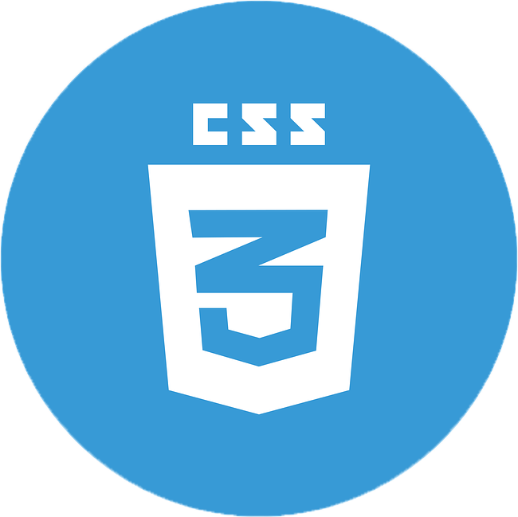
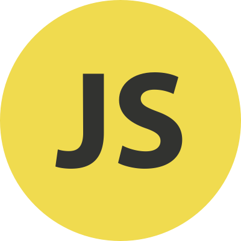

## Hi there!

I'm Sefa. You will find Machine Learning and Frontend projects on this profile. I'm full time Jr. Frontend Developer. Actually Junior of Junior. 🙂 I try to check and create Machine Learning projects in my free time.

Mostly, I develop my projects in English. In some projects, I'll be taking notes in my mother language which is Turkish. I suggest you to read the readme file before check my projects. I will let you know about it, at the top of explenation.

 

## Languages and Tools That I Use:

 
